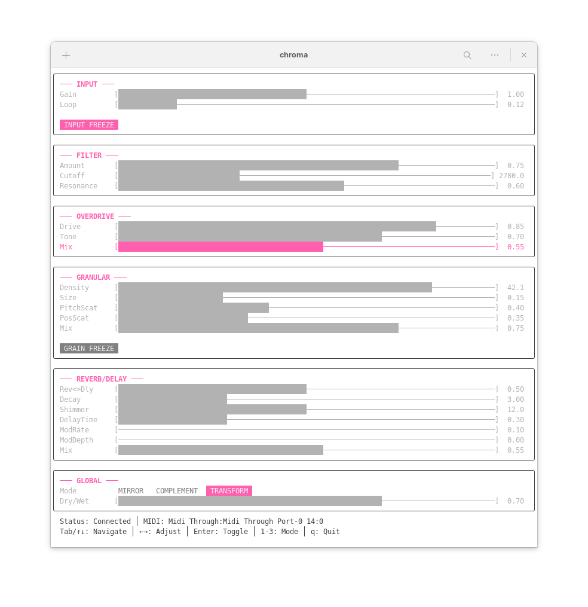

# Chroma

Spectral-reactive effects processor for SuperCollider.

## Overview

Chroma analyzes the spectral content of incoming audio and uses that analysis to control a chain of effects processors. Three blend modes define different relationships between input spectrum and effect parameters.

## Effects

- **Spectral Filter**: Multi-band filter with spectrum-driven gain per band
- **Overdrive**: Soft-clip saturation with tone control
- **Granular Processor**: Granular synthesis with freeze capability
- **Shimmer Reverb**: Pitch-shifted reverb for ethereal textures
- **Modulated Delay**: Chorus-style delay with LFO modulation

## Requirements

- SuperCollider 3.10+
- Audio interface with input

## Installation

1. Copy `Chroma.sc` to your SuperCollider Extensions folder:
   - macOS: `~/Library/Application Support/SuperCollider/Extensions/`
   - Linux: `~/.local/share/SuperCollider/Extensions/`
   - Windows: `%LOCALAPPDATA%\SuperCollider\Extensions\`

2. Recompile class library: `Language > Recompile Class Library` or Cmd+Shift+L

## Usage

### Quick Start

```bash
./run.sh --list        # List available audio devices
./run.sh -d 1          # Use audio card 1 (e.g., USB interface) and save to config
./run.sh               # Use saved device from config
```

The device selection is saved to `~/.config/chroma/config`.

### From SuperCollider IDE

```supercollider
Chroma.start;  // Launch headless audio engine
Chroma.stop;   // Stop and cleanup
```

Chroma runs headless (no GUI). Use the Terminal UI or OSC messages for control.

### Terminal UI



Download pre-built binaries from [Releases](https://github.com/renderorange/chroma/releases):

```bash
# Linux (amd64)
curl -LO https://github.com/renderorange/chroma/releases/latest/download/chroma-tui-linux-amd64
chmod +x chroma-tui-linux-amd64
./chroma-tui-linux-amd64

# Linux (arm64)
curl -LO https://github.com/renderorange/chroma/releases/latest/download/chroma-tui-linux-arm64
chmod +x chroma-tui-linux-arm64
./chroma-tui-linux-arm64

# macOS (Apple Silicon)
curl -LO https://github.com/renderorange/chroma/releases/latest/download/chroma-tui-darwin-arm64
chmod +x chroma-tui-darwin-arm64
./chroma-tui-darwin-arm64

# macOS (Intel)
curl -LO https://github.com/renderorange/chroma/releases/latest/download/chroma-tui-darwin-amd64
chmod +x chroma-tui-darwin-amd64
./chroma-tui-darwin-amd64

# Windows (amd64) - download and run chroma-tui-windows-amd64.exe
```

Or build from source:

```bash
# Install deps (Linux)
sudo apt update && sudo apt install libasound2-dev

# Build the TUI (requires Go)
cd chroma-tui && go build

# Run with defaults (connects to localhost:57120)
./chroma-tui

# Run with options
./chroma-tui --host 192.168.1.10 --port 57120 --no-midi
```

**Keyboard controls:**
- Tab / ↑↓ : Navigate controls
- ←→ : Adjust values
- Enter/Space : Toggle freeze buttons
- 1-3 : Switch blend modes
- q : Quit

**MIDI:** Automatically connects to first available MIDI input. Configure mappings in `~/.config/chroma/midi.toml`.

## Controls

### Blend Modes

- **Mirror**: Input spectrum directly shapes effects (loud bass = more low-frequency filtering)
- **Complement**: Inverted relationship (loud bass = less low-frequency filtering)
- **Transform**: Spectral features map creatively (brightness affects pitch shift, spread controls grain density)

### Parameters

| Control | Range | Description |
|---------|-------|-------------|
| Gain | 0-2 | Input amplification |
| Input Freeze | on/off | Freeze input signal as sustained looping tone |
| Loop | 50-500ms | Input freeze loop length |
| Smoothing | 0.01-0.5s | Analysis response time |
| Dry/Wet | 0-1 | Balance between dry input and processed signal |
| Filter Amount | 0-1 | Spectral filter intensity |
| Overdrive Drive | 0-1 | Saturation amount |
| Overdrive Tone | 0-1 | Post-drive brightness (dark to bright) |
| Overdrive Mix | 0-1 | Dry/wet blend for overdrive |
| Granular Mix | 0-1 | Granular effect level |
| Grain Freeze | on/off | Freeze granular buffer for textural grains |
| Reverb Mix | 0-1 | Shimmer reverb level |
| Delay Mix | 0-1 | Modulated delay level |
| Reverb/Delay Blend | 0-1 | Balance between reverb and delay paths |

## Configuration

```supercollider
// Access running instance
Chroma.instance.setBlendMode(\transform);
Chroma.instance.setDryWet(0.7);
```

## Architecture

```
Audio Input -> Input Freeze -> FFT Analysis -> Feature Extraction -> Control Buses
                    |                                                      |
                    v                                                      v
              Spectral Filter <--------- Blend Mode ----------------> Overdrive
                    |                                                      |
                    v                                                      v
                Granular <-----------------------------------------> Shimmer Reverb
                    |                                                      |
                    v                                                      v
                Mod Delay <-------------------------------------------> Output Mixer
```

## License and Copyright

`Chroma` is Copyright (c) 2026 Blaine Motsinger under the MIT license.
